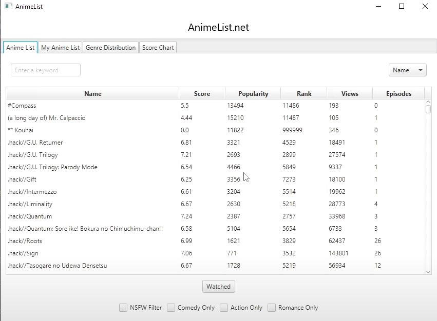

# AnimeListApp 
Anime Data Visualizer with JavaFX

### Overview
Anime Data Visualizer is a JavaFX project designed to provide insights into anime data sourced from a CSV file based on MyAnimeList. The application allows users to explore anime titles, visualize genre distribution through a pie chart, and analyze statistical data using a bar chart.

### Anime Selection:
Browse a list of anime titles loaded from MyAnimeList.
Select an anime to view detailed information.

### Genre Distribution
Visualize the distribution of genres in the selected anime list using a pie chart.

### Statistical Data
View statistical metrics, such as ratings, episode counts, etc., for the entire anime list via a bar chart

## Tech

Made using JavaFX, as per the requirement of this project, sorting and searching algorithms such as Merge Sort and Linear Search were used.

## Gallery

#### Project created for my ICS4U (Grade 12 University Computer Science) Culminating Performance Task.
